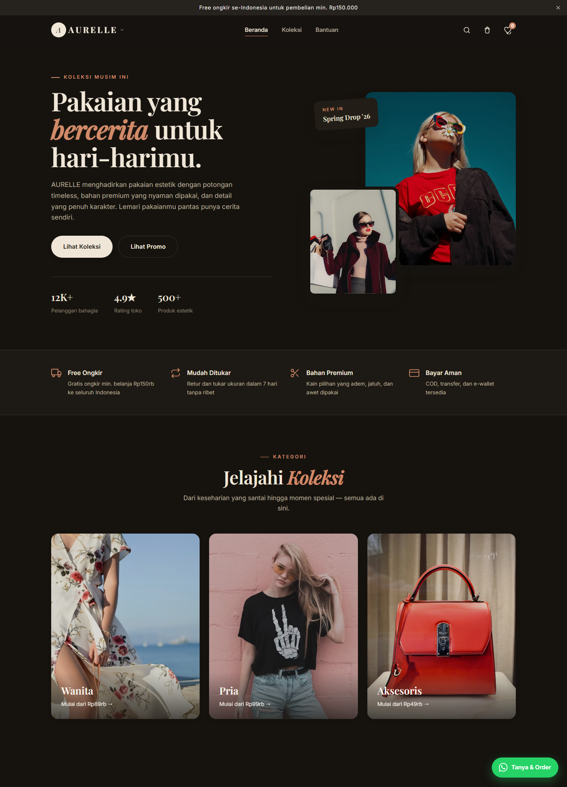
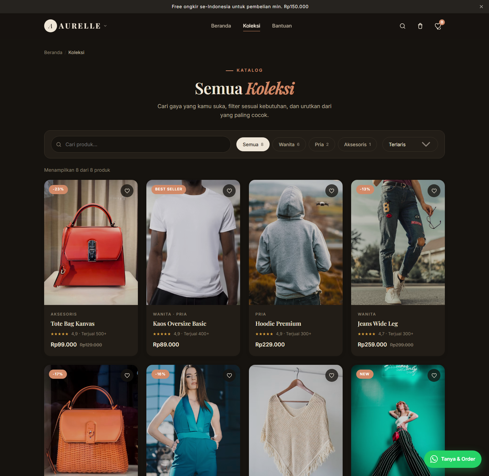
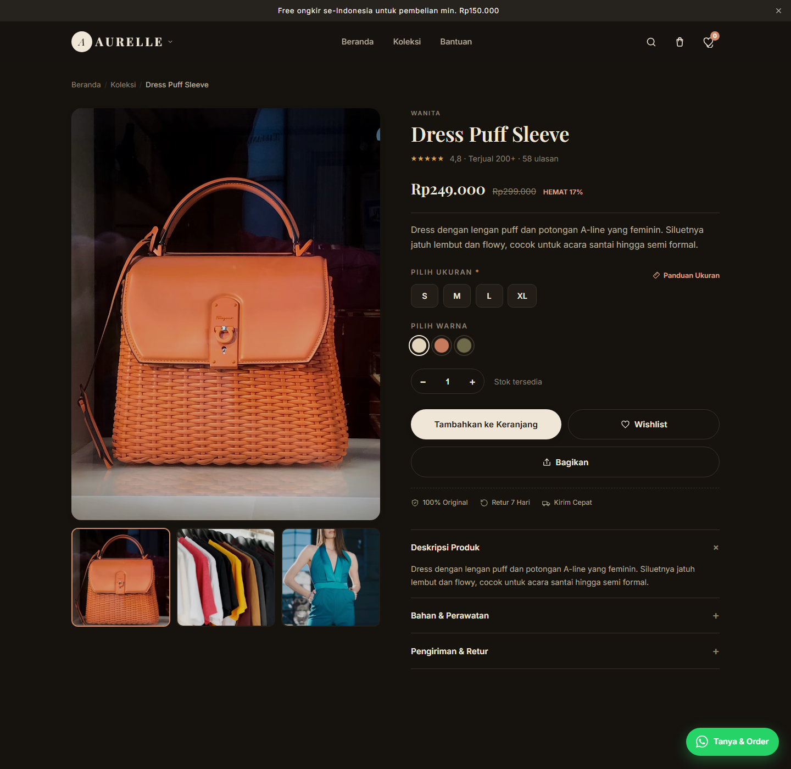
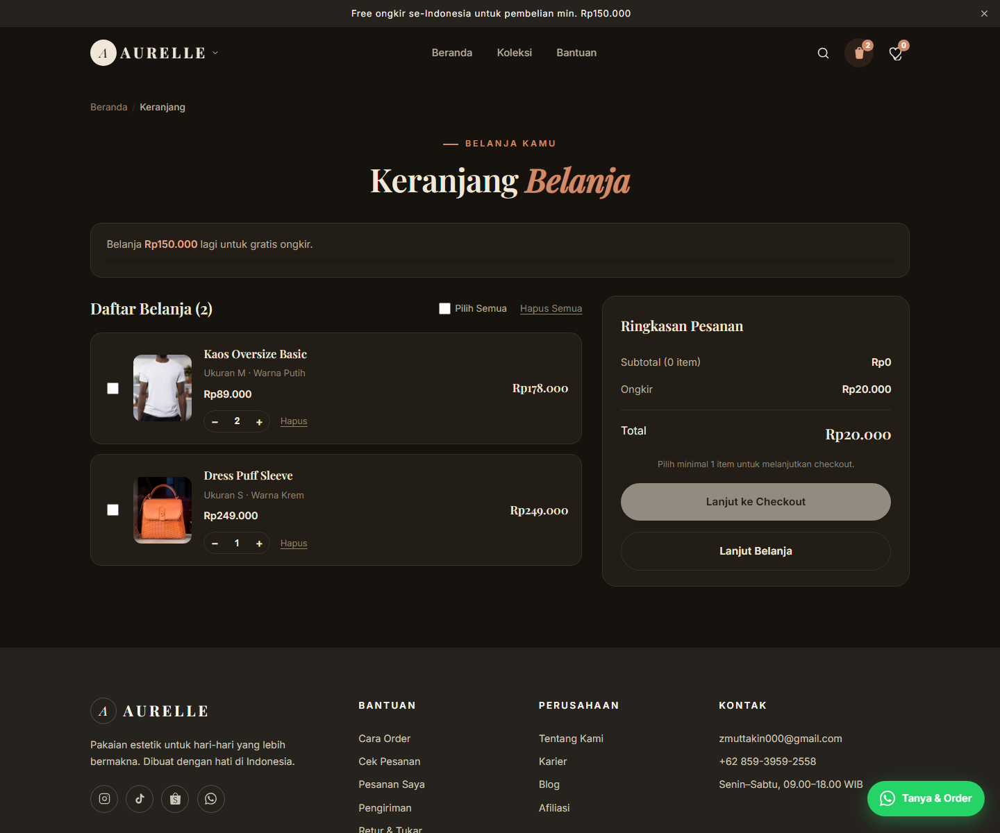

# AURELLE

Website toko pakaian estetik — statis murni (HTML, CSS, JavaScript) tanpa backend dan tanpa build step.

## Screenshot

| Beranda | Katalog |
| --- | --- |
|  |  |
| Detail produk | Keranjang |
|  |  |

## Fitur

- **Beranda** — hero, kategori, promo, tentang, testimoni, kontak
- **Katalog** (`koleksi.html`) — filter kategori, pencarian live, urutan harga/rating/terlaris, deep-link lewat URL
- **Detail produk** (`produk.html`) — pilih ukuran & warna, panduan ukuran (modal), tambah ke keranjang, wishlist, rekomendasi “Kamu Mungkin Suka” (produk sekategori + tambah cepat ke keranjang)
- **Keranjang** (`keranjang.html`) — ubah jumlah, hapus, progress gratis ongkir (min. Rp150.000)
- **Wishlist** (`wishlist.html`) — tersimpan di localStorage + badge di navbar
- **Checkout** (`checkout.html`) — form alamat dengan validasi, metode pembayaran, pesan sukses
- **Bantuan** (`bantuan.html`) — cara order, pengiriman, retur & tukar, FAQ
- **Cek Pesanan** (`cek-pesanan.html`) — cari status pesanan dengan timeline (data contoh + pesanan tersimpan lokal)
- **Akun** — halaman pengguna: `pesanan.html`, `alamat.html`, `voucher.html`, `profil.html` (fitur placeholder siap dikembangkan), `masuk.html` (login demo: nama & email disimpan ke localStorage, avatar muncul di navbar)
- **Blog** (`blog.html` + `artikel.html`) — tips ukuran, perawatan, inspirasi outfit (halaman artikel terpisah)
- **Karier** (`karier.html`) — lowongan kerja + CTA lamaran via WhatsApp/email
- **Afiliasi** (`afiliasi.html`) — program komisi 8–12% + kalkulator simulasi komisi
- **Admin** (`admin.html`) — dashboard ringkas, kelola produk/pesanan/pelanggan, mode demo tanpa backend (produk: ubah hanya di sesi — pesanan: tersimpan lokal & statusnya bisa diubah)
- **Pencarian** — ikon search di navbar membuka modal live search (filter nama/kategori dari `PRODUCTS`, hasil menuju `produk.html?id=N`, tombol "Lihat semua hasil" menuju `koleksi.html?q=...`)
- **Newsletter** — form beranda berfungsi: validasi email, simpan subscriber (mode demo), pesan sukses
- **Penunjang UX** — announcement bar bisa ditutup (diingat), tombol kembali ke atas muncul setelah scroll
- Tema terang/gelap (toggle di menu akun), navbar aktif + scrollspy, tombol kembali ke atas, animasi scroll halus
- **Navigasi** — dropdown brand "Tentang Kami", menu akun di navbar (status tamu/login + tema + keluar), quick actions di menu mobile, navigasi keyboard (panah/Escape) di dropdown
- Data tersimpan di `localStorage` per browser (keranjang, wishlist, tema, user, riwayat pencarian)

## Struktur

```
index.html        Beranda
koleksi.html      Katalog + filter + pencarian
produk.html       Detail produk
keranjang.html    Keranjang
wishlist.html     Wishlist
checkout.html     Checkout
bantuan.html      Pusat bantuan (cara order, pengiriman, retur, FAQ)
cek-pesanan.html  Cek status pesanan (timeline; data contoh + pesanan tersimpan lokal)
blog.html         Blog (tips, perawatan, inspirasi)
artikel.html      Halaman isi artikel (blog + artikel terkait)
karier.html       Lowongan kerja (posisi + CTA lamaran)
afiliasi.html     Program afiliasi (komisi + kalkulator)
masuk.html        Login demo (nama & email -> localStorage)
pesanan.html      Pesanan Saya (timeline sederhana)
alamat.html       Buku Alamat (placeholder)
voucher.html      Voucher Saya (placeholder)
profil.html       Pengaturan Akun (placeholder)
admin.html        Panel admin (compact; kelola status pesanan tersimpan lokal)
css/style.css     Seluruh styling (15 bagian)
js/data.js        Data produk, kategori, konfigurasi ongkir
js/site.js        Utilitas bersama (tema, keranjang, wishlist, pencarian, dropdown, dll.)
js/*.js           Logika per halaman
```

## Preview lokal

```sh
# Opsi 1 — Python
py -m http.server 8000
# buka http://localhost:8000

# Opsi 2 — Node
npx serve
```

## Deploy gratis

Semua path relatif, jadi tinggal unggah foldernya.

- **Netlify Drop** — buka https://app.netlify.com/drop, seret folder ini, selesai.
- **GitHub Pages** — push repo ini, lalu *Settings → Pages → Deploy from branch* (`main`, root). URL: `https://<username>.github.io/<repo>/`
- **Cloudflare Pages / Vercel** — import repo atau unggah folder lewat dashboard. Tidak ada build command.

## Mengubah data produk

Edit `js/data.js` — array `PRODUCTS` (nama, harga, gambar, ukuran, warna, deskripsi, dll.) dan `KATEGORI`.

## Validasi

Skrip di `tools/` — jalankan dari folder root (`node tools/...`):

```sh
node tools/smoke-test.cjs  # cek tautan internal, asset, ID duplikat, dll.
node tools/seo-scan.cjs    # meta tag wajib (title, description, Open Graph) di semua halaman
node tools/a11y-scan.cjs   # alt gambar, label form, nama aksesibel tombol & ikon-link, role dialog
node tools/screenshots.cjs # regenerasi screenshot di screenshots/ (butuh Edge/Chrome)
```

Ketiga skrip validasi juga otomatis dijalankan oleh GitHub Actions (`.github/workflows/ci.yml`) di setiap push — deploy ke GitHub Pages ikut otomatis. Siapkan dulu: *Settings → Pages → Source: GitHub Actions*.

Halaman `404.html` menangani URL yang tidak ada (kustom, dengan `noindex`); `admin.html` dan `masuk.html` juga di-noindex dari mesin pencari.

© 2026 AURELLE
